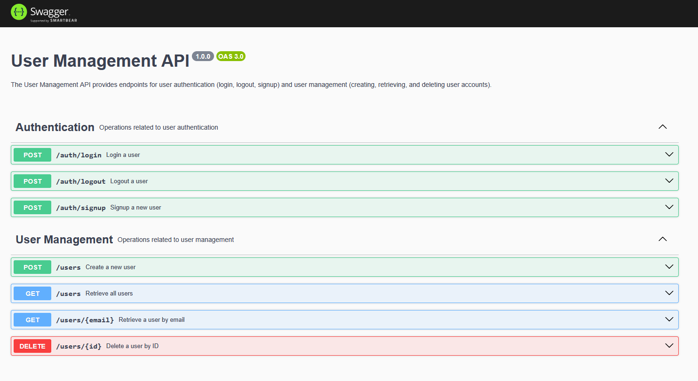

## Description

Backend in NestJS with mongoDB

## Project setup
The backend needs a local mongoDB to interact with. Run the following comment to run one with docker :
```bash
docker compose up mongodb -d
```

Install necessary packages
```bash
npm i
```

## Compile and run the project

```bash
$ npm run start:dev
```

**⚠️ Warning:** With `Windows` environment, in `package.json` remove `NODE_ENV=development` for the command `"start:dev"`.
Run `NODE_ENV=development` then execute `npm run start:dev`

## Run tests

```bash
# unit tests
$ npm run test

# e2e tests
$ npm run test:e2e

# test coverage
$ npm run test:cov
```

## Swagger

To read swagger documentation, start backend and go to http://localhost:3000/api-docs.



